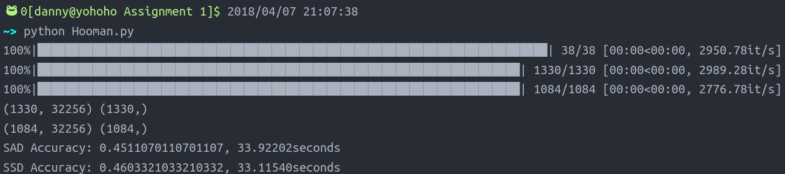

# Nearest Neighbor Search

## Method Description

1.	Load data path
2.	Load data and labels
3.	Find nearest neighbor with sum of absolute distance between test data and training data
	-	Implemtation: scipy.spatial.distance.cdist
4.	Find nearest neighbor with sum of square distance between test data and training data
	-	Implemtation: scipy.spatial.distance.cdist

## Results

SAD: 0.4511 in 33.92 seconds
SSD: 0.4603 in 33.12 seconds

## Discussion

During this assignment, I've tried 3 kinds of ways computing the results. The 3 ways are for loop, numpy broadcasting, and cdist from scipy in the order from slow to fast. I also learned something really important: The generator mechanism in Python is something really passive. Hence, generators should be used wisely, as they would slow down the whole process as a side effect.
