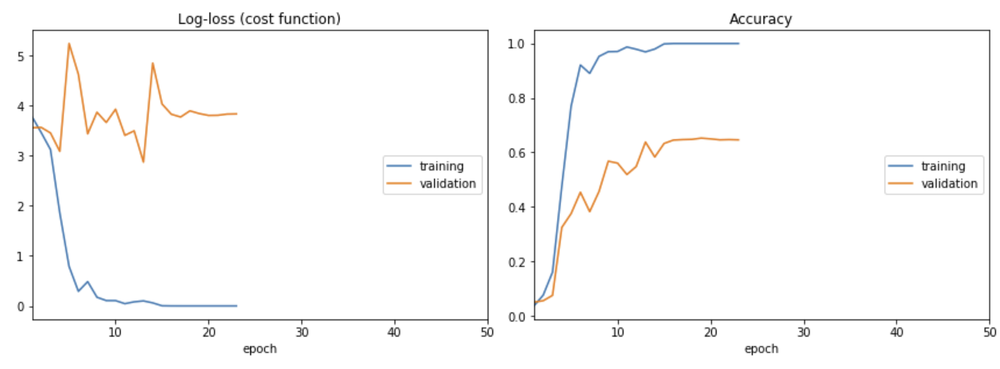
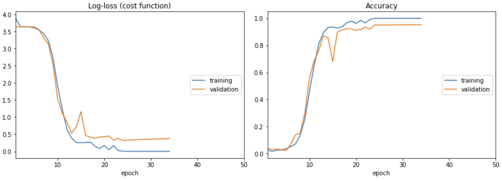
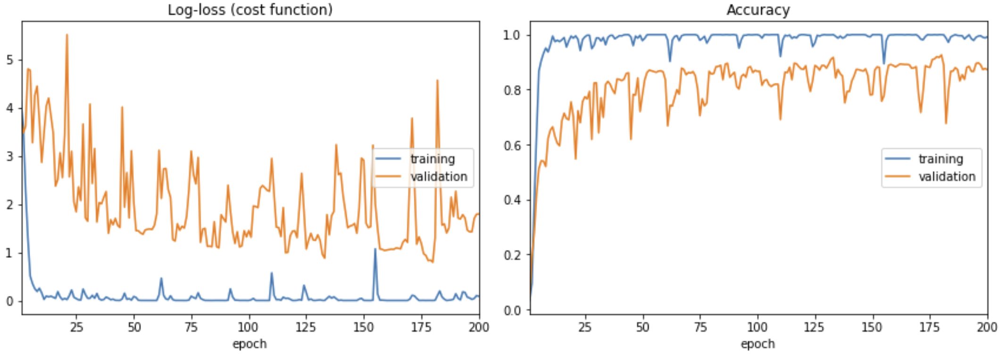
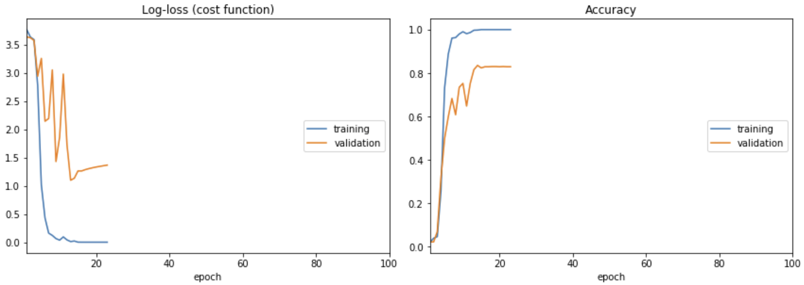
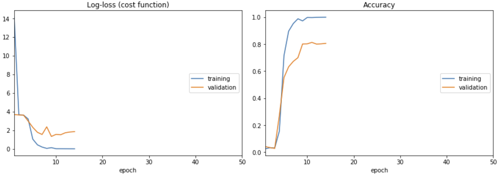

# Face Recognition by Keras

## Method Description

1.	Load data path
2.	Load data and labels
3.	Use modified VGG16 versions to classify the pictures. This is a 38-class problem. Hence, the last layer is set to be a fully connected layer with 38 internal nodes and softmax as its activation function. The Keras-builtin 'sparse_categorical_crossentropy' is selected as the loss function. Here is a list about each modified version:
	-	Pre-trained weights by PPMI:
		1.	The initial weights are loaded from pre-trained PPMI.
		2.	Batch size: 10

	-	Pre-trained weights by PPMI - shuffled:
		1.	The initial weights are loaded from pre-trained PPMI.
		2.	Batch size: 10
		3.	**data is shuffled before splitting into training / validation set**

	-	Pre-trained weights by PPMI - SELU:
		1.	The initial weights are loaded from pre-trained PPMI.
		2.	Batch size: 10
		3.	Add 3 fully connected layer before the last layer:
			1.	dense_1:
				1.	internal nodes: 256
				2.	activation function: selu
				3.	initialization: lecun_normal
				4.	post layer: alphadropout with dropout rate: 0.2
			2.	dense_2:
				1.	internal nodes: 128
				2.	activation function: selu
				3.	initialization: lecun_normal
				4.	post layer: alphadropout with dropout rate: 0.1
			3.	dense_3:
				1.	internal nodes: 128
				2.	activation function: selu
				3.	initialization: lecun_normal
				4.	post layer: alphadropout with dropout rate: 0.1

	-	Random Normal:
	 	1.	The initial weights are selected randomly from normal distribution with:
		 	1.	mean: 0
		 	2.	standard deviation: 0.025
		2.	Batch size: 10

	-	Random Uniform:
	 	1.	The initial weights are selected randomly from uniform distribution with:
		 	1.	lower bound: -0.05
		 	2.	upper bound: 0.05
		2.	Batch size: 10

## Validation Accuracy

### VGG16 Variants

-	Pre-trained weights by PPMI: 0.646168

-	Pre-trained weights by PPMI - Shuffled: 0.952763

-	Pre-trained weights by PPMI - SELU: 0.871658

-	Random Normal: 0.828877

-	Random Uniform: 0.805704

### Nearest Neighbors

-	SAD: 0.4511
-	SSD: 0.4603

## Analysis

First, we can see that "VGG Variants" performs much better than conventional sum of absolute distance(SAD) or sum of squared distance(SSD). Unlike SAD and SSD, neural networks try to extract the features of an image, thus they are more robust. For example, if an image is shifted by one pixel, SAD and SSD may give a huge error value while neural networks tends to ignore the shift and output a smaller error.

Next, let's take a closer lookup at different "VGG16 Variants".

### Initialization

From the results, random weights versions seem to perform better than PPMI pre-trained weights. Maybe it is because PPMI is a problem which differs a lot from this multi-class classification task. Hence the pre-trained weights give negative effects on this problem.

### Optimization Based on Pre-trained PPMI Weights

We learned that a deepened pre-trained neural network performs better than the origin in most cases. So, I added 3 more fully connected layers and regularized it with dropout layers concatenated right after each one. This increased the validation accuracy from 0.646168 to a desirable 0.871658.

### Shuffling Input Data?

If the data is shuffled before splitting into training / validation data, it gives a surprising validation accuracy of 0.952763. This is because of the quality of the input data varies a lot. And the original train data contains a few "broken" data. However, shuffling the data would make "VGG16 Variants" and "Nearest Neighbors" inconsistent and make them incomparable.

### Batch Size

I've also tried different batch sizes. But it didn't make much difference this time.

### Caution
In order to make "VGG16 Variants" and "Nearest Neighbors" comparable, all "VGG16 Variants" have exactly the same input data as that of "Nearest Neighbors", except "Pre-trained weights by PPMI - shuffled".

## Problems Encountered

Days ago, some of my friends said their validation accuracy of vanilla "Pre-trained weights by PPMI" is above 0.85 which is a shock to me. I thought that there may be a serious flaw in my program. After some discussions and experiments, we found that it is just because they shuffled the data at the very start. What a relief!
