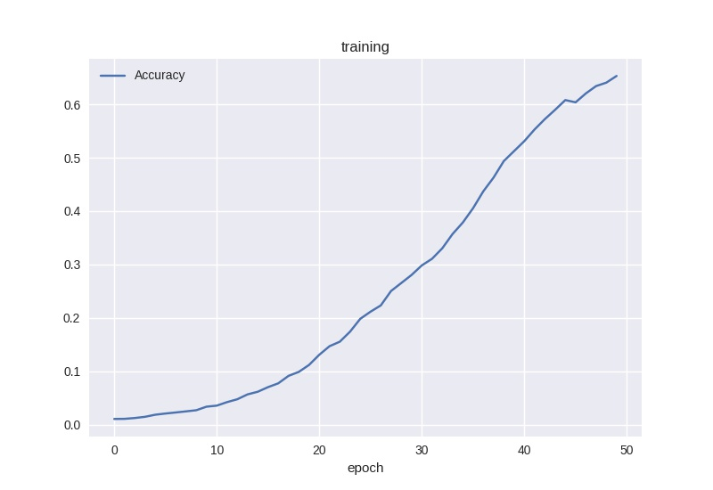
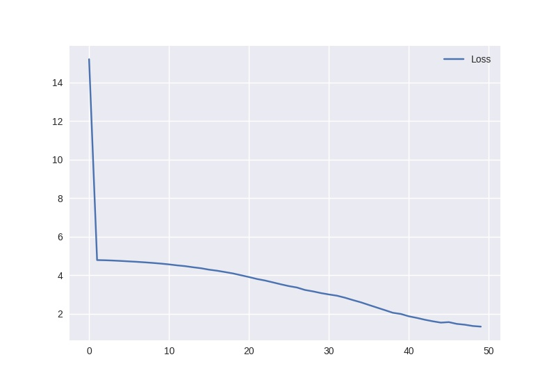
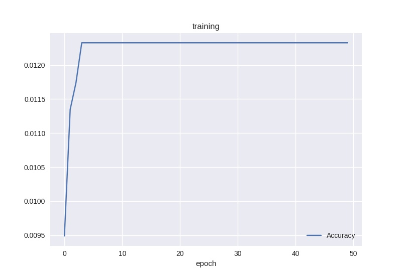
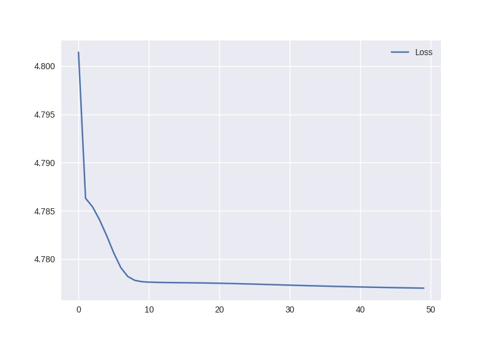
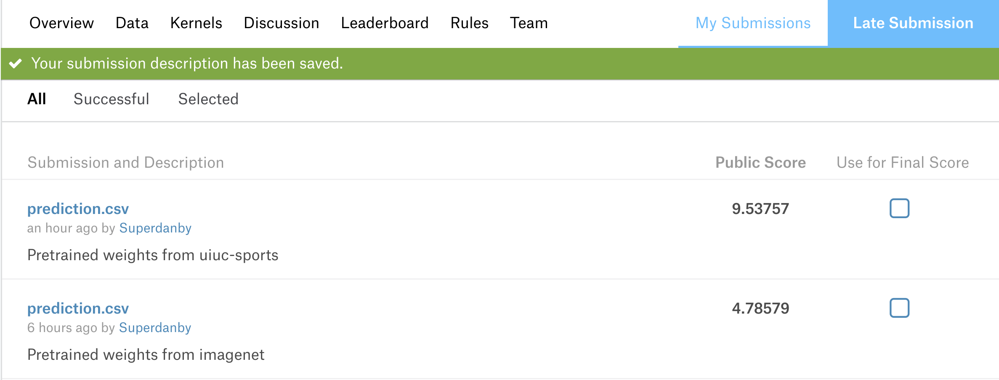

# [Dog Breed Identification](https://www.kaggle.com/c/dog-breed-identification)

## Method Description

1.	Load data path
2.	Load data and labels
3.	Use modified VGG16 versions to classify the pictures. This is a 120-class problem. Hence, the last layer is set to be a fully connected layer with 120 internal nodes and softmax as its activation function. The `tf.losses.softmax_cross_entropy` is selected as the loss function. Here is a list about each modified version:
	-	Pre-trained weights by [uiuc-sports](http://vision.stanford.edu/lijiali/event_dataset/):
		1.	The initial weights are loaded from pre-trained uiuc-sports.
		2.	Batch size: 32

	-	Pre-trained weights by [Imagenet](http://www.image-net.org/):
		1.	The initial weights are loaded from pre-trained Imagenet.
		2.	Batch size: 32

## Training Accuracy & Loss

-	uiuc accuracy:

-	uiuc loss:

-	Imagenet accuracy:

-	Imagenet loss:

## LB Score

-	Pre-trained weights by uiuc: 9.53757
-	Pre-trained weights by Imagenet: 4.78579

## Problems Encountered

The uiuc-sports dataset has only 8 classes. It has a huge difference with this 120-class problem. And, in this problem, there is few data for each class(around 80 pics per class). So, the result of uiuc pre-trained weights is terrible. Though the pre-trained weights from Imagenet has a much better score, it is only slightly better than guessing randomly. I think I should do more on data augmentation. It's a pity that the deadline has arrived.

## Refernce

[https://www.kaggle.com/ardiya/tensorflow-vgg-pretrained/notebook](https://www.kaggle.com/ardiya/tensorflow-vgg-pretrained/notebook)
