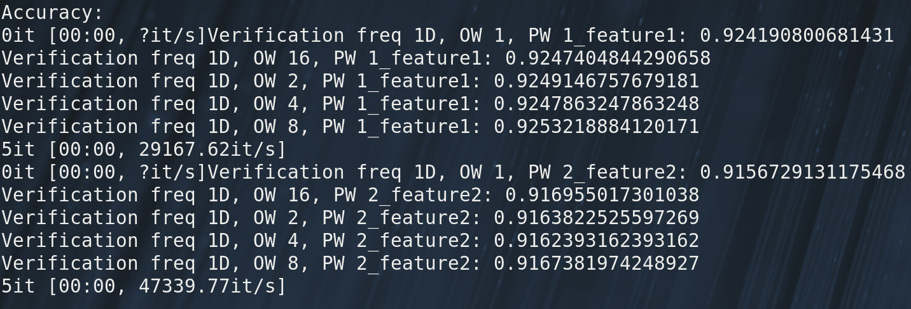

# [Nexperia Predictive Maintenance Full](https://www.kaggle.com/c/nexperia-predictive-maintenance-full-1)

## Method Description

1.	Load data path
2.	Load data and labels
3.	Extract the **Count** feature from the data
4.	Use `svm.SVR()` with different parameters and choose the best model to predict the test data.

## Validation Accuracy

## Problems Encountered

-	No matter what arguments are given, the svm model just can't fit the data. The output of the predicted labels are mostly(or entirely) *False*.
